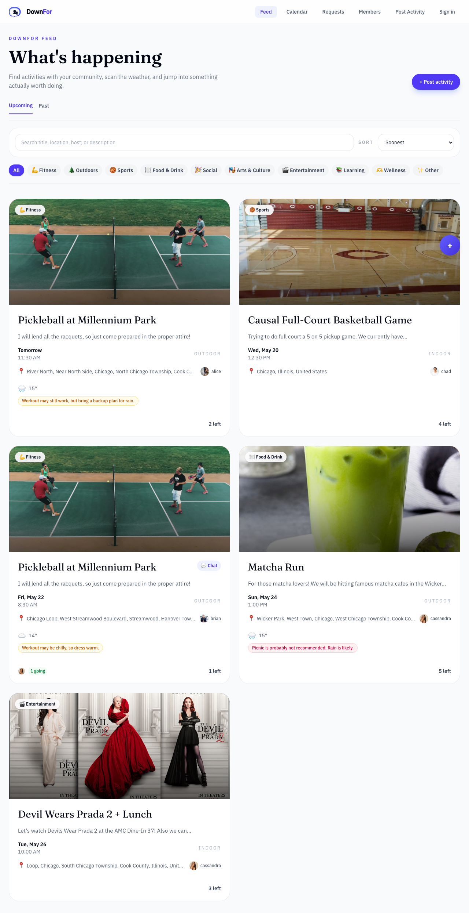
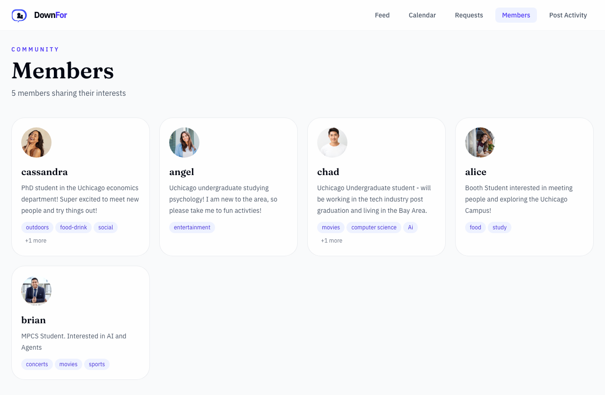

# DownFor

DownFor is a desktop-first activity board for finding people to do things with. Users can post activities, request to join them, approve or decline requests, chat in a shared activity thread, and browse the community in a calendar and members view.

The app is built on a production stack:
- Clerk for authentication
- Supabase for persistence and row-level security
- Open-Meteo for weather and geocoding
- Railway for background weather refreshes
- Resend for opt-in email notifications
- Vercel for deployment

Live app: https://downfor.vercel.app

## Screenshots





## What’s in the app

- Desktop-style feed with search, sort, category filters, weather-aware activity cards, and unread chat badges
- Activity detail pages with join requests, request approval/rejection, cancel/reopen flows, shared chat, photo attachments, message deletion, and copy-link support
- Requests dashboard with sent/incoming request views, status filters, unread chat indicators, and notification badges
- Calendar view with month navigation, month picker, today shortcut, and upcoming schedule
- Members directory and public member profile pages
- Profile page with edit state, notification preferences, and hosted/joined activity sections
- Location autocomplete and weather-aware outdoor activity support
- Email notifications for request updates and chat messages, controlled by profile toggles

## Core Routes

- `/feed` - activity feed
- `/create` - post a new activity
- `/requests` - sent and incoming requests
- `/calendar` - month view and upcoming schedule
- `/members` - public community directory
- `/members/[id]` - public member profile
- `/profile` - current user profile and hosted/joined activities
- `/activity/[id]` - activity detail, requests, and chat

## Architecture Notes

- Outdoor activities use Open-Meteo forecasts.
- A Railway worker refreshes weather in the background through `/api/cron/weather-refresh`.
- Approved attendees and the host share one activity chat thread.
- Chat messages can include photo attachments, and senders can delete their own messages.
- The app now includes in-app unread notifications, a bell panel, and email preferences in the profile editor.
- Email delivery uses Resend’s test path for now, so it can send to one specific inbox tied to the active Resend account. Broad production email sending would require a verified domain and a proper production setup.

## Automation and Safety

- Playwright smoke tests cover the public routes, with an opt-in authenticated spec for private pages.
- GitHub Actions runs build + browser checks on push and pull request.
- The repository includes security hardening around profiles RLS, host-side request authorization, a rate-limited public location search endpoint, and agent deny lists for secrets.

## Quick Start

```bash
npm install
npm run dev
```

Open `http://localhost:3000`.

## Environment Variables

Create a local `.env.local` file with the values from your deployment dashboard:

```bash
NEXT_PUBLIC_SUPABASE_URL=...
NEXT_PUBLIC_SUPABASE_PUBLISHABLE_KEY=...
SUPABASE_SERVICE_ROLE_KEY=...
NEXT_PUBLIC_CLERK_PUBLISHABLE_KEY=...
CLERK_SECRET_KEY=...
CRON_SECRET=...
DOWNFOR_API_URL=...
LOCATION_AUTOCOMPLETE_PROVIDER=...
RESEND_API_KEY=...
RESEND_FROM_EMAIL=...
```

The repository ignores `.env*` files by default.

## Testing

Manual smoke checklist: [docs/SMOKE_TESTS.md](docs/SMOKE_TESTS.md)

Run the public browser smoke suite:

```bash
npx playwright install chromium
npm run test:e2e
```

Run the full browser suite, including the opt-in authenticated spec:

```bash
npm run test:e2e:all
```

Create an authenticated Playwright state file for private-page tests:

```bash
npm run auth:record
```

If the local Clerk page does not render, use the production app instead:

```bash
npm run auth:record:prod
```

Run only the authenticated spec:

```bash
npm run test:e2e:auth
```

Run the authenticated spec against production:

```bash
npm run test:e2e:auth:prod
```

## Notes for Reviewers

- The project started from a standard Next.js scaffold, but the current app is now a full shipped product rather than a boilerplate demo.
- The code intentionally defers push notifications, real-time presence, maps, and a broad production email setup to keep the core loop solid.
- If you want a quick orientation, start with the feed, requests, calendar, members, and activity detail pages.
